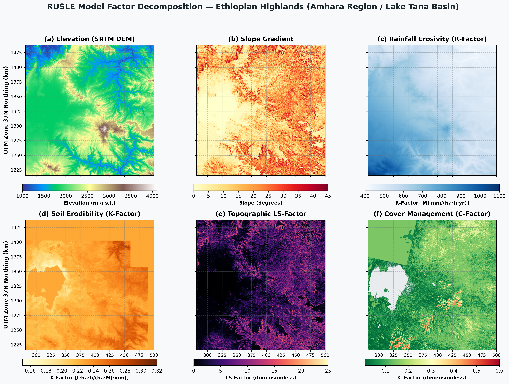
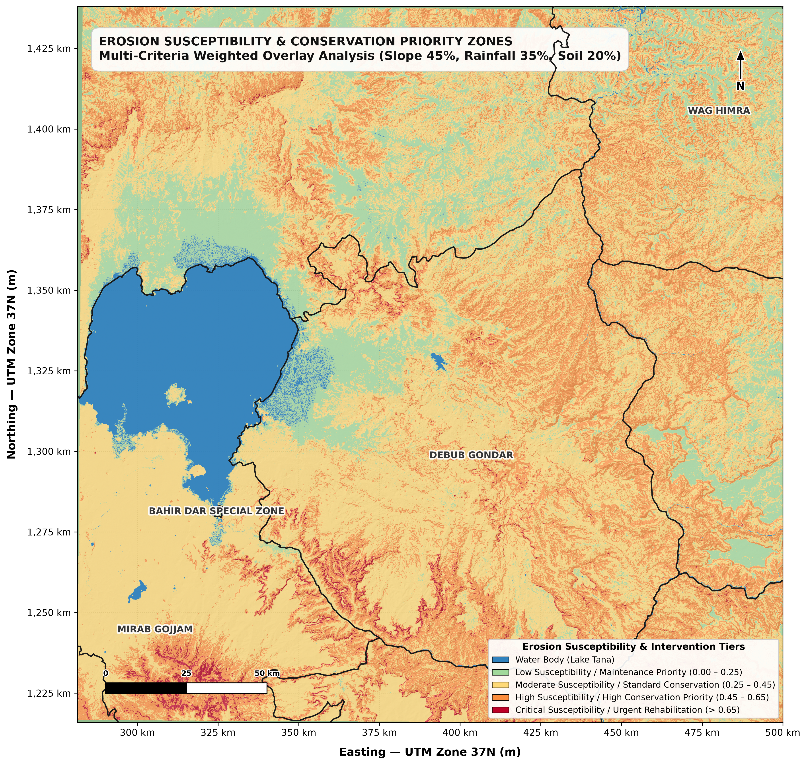
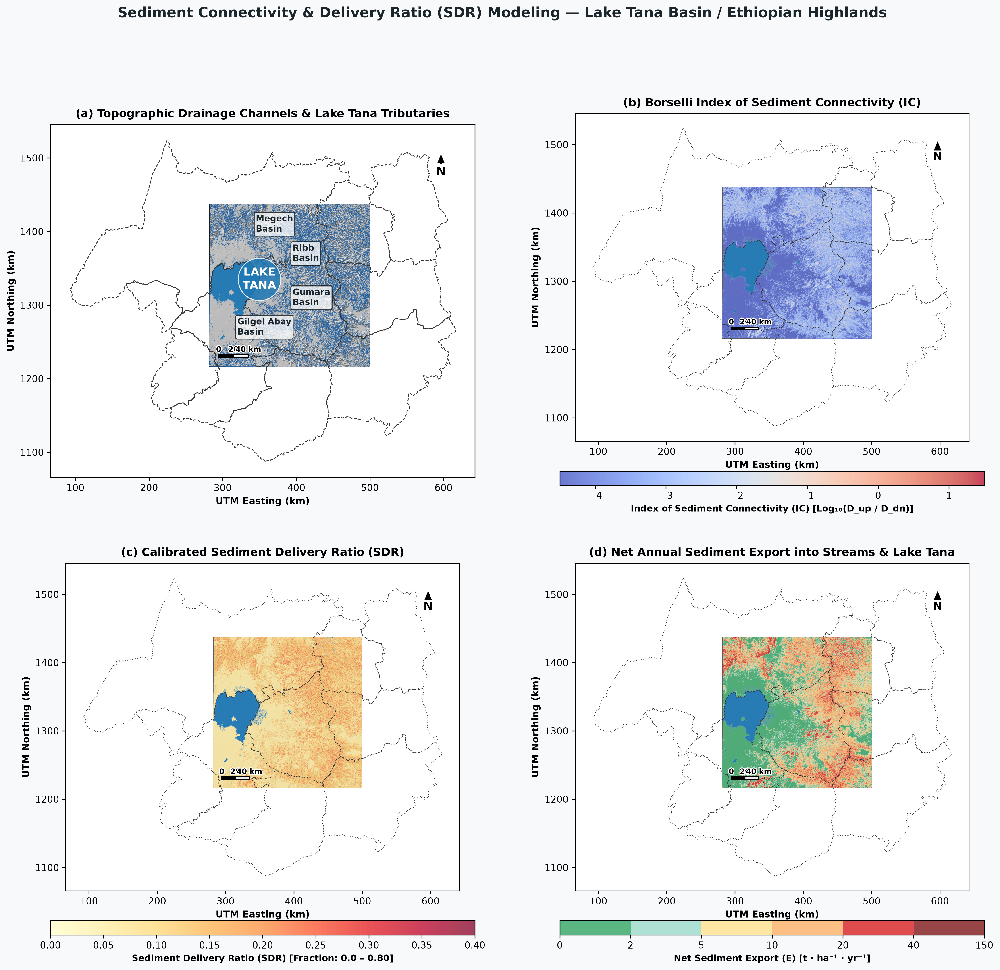
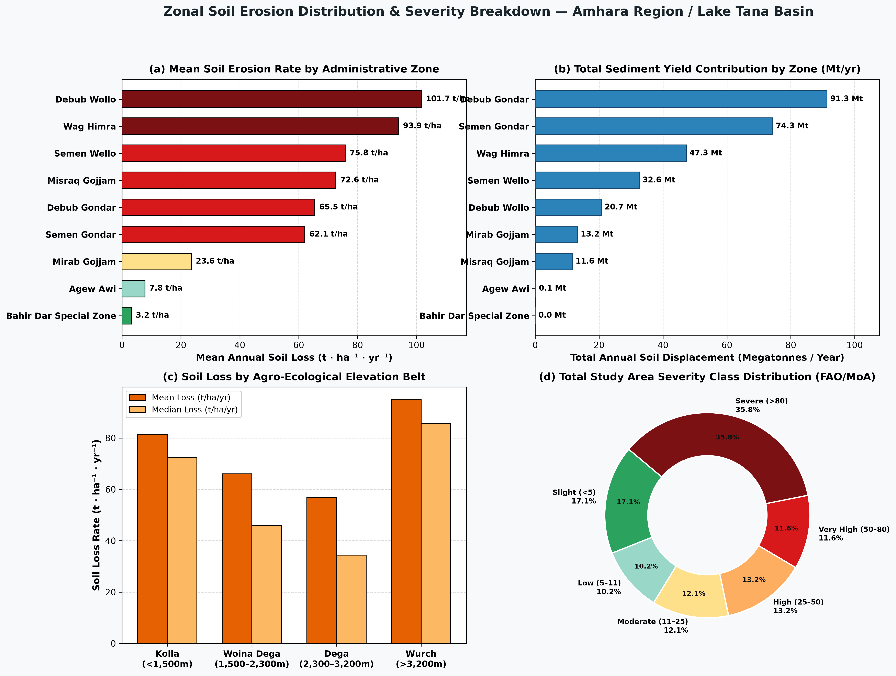
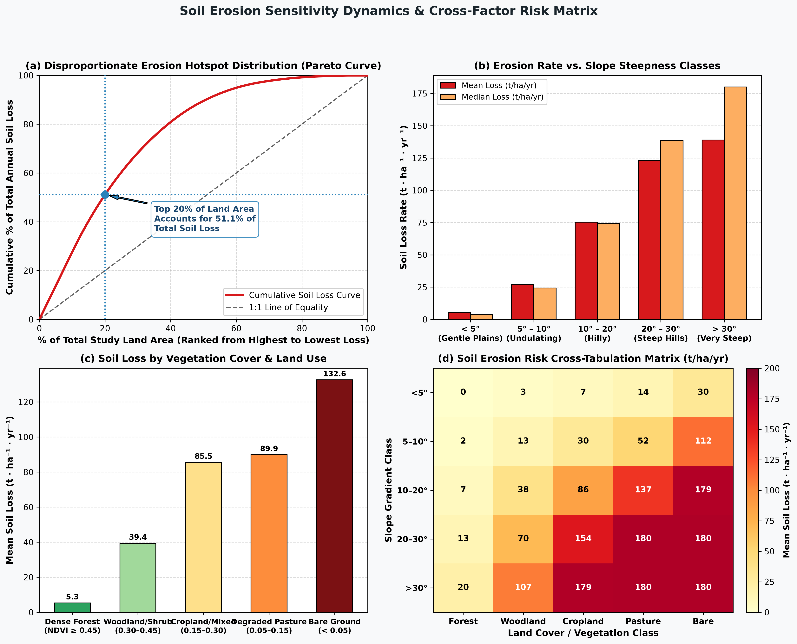
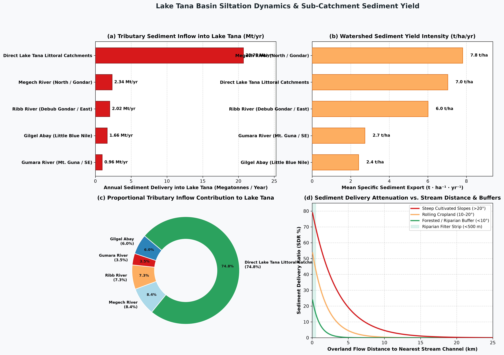

# Soil Erosion & Sediment Delivery Ratio (SDR) Modeling in the Ethiopian Highlands
### Quantitative RUSLE Assessment, Stream Sediment Connectivity & Lake Tana Siltation Dynamics (Amhara Region / Upper Blue Nile)

---

## 📌 Executive Summary

Soil erosion and downstream reservoir siltation pose severe threats to agricultural sustainability, hydropower generation, and aquatic ecology across the **Ethiopian Highlands**. 

This repository provides an automated GIS and remote sensing modeling framework integrating:
1. **The Revised Universal Soil Loss Equation (RUSLE)** for gross hillslope soil detachment ($A$).
2. **Multi-Criteria Weighted Overlay Analysis (MCDA)** for erosion susceptibility priority zonation.
3. **The Borselli / InVEST Sediment Delivery Ratio (SDR)** model for tracing sediment transport through stream networks into **Lake Tana** and river tributaries.

```
Core Mathematical Formulations:

1. Gross Soil Detachment (RUSLE):
   A = R × K × LS × C × P  [t · ha⁻¹ · yr⁻¹]

2. Index of Sediment Connectivity (IC):
   IC = log₁₀( D_up / D_dn )
   Where:
     D_up = W_mean × S_mean × √(A_contrib)  [Upslope sediment generation potential]
     D_dn = ∑ ( d_i / (W_i × S_i) )          [Downslope flow path resistance to streams]

3. Sediment Delivery Ratio (SDR):
   SDR = SDR_max / ( 1 + exp( (IC_0 - IC) / k ) )

4. Net Annual Sediment Export (E):
   E = A × SDR  [t · ha⁻¹ · yr⁻¹]
```

---

## 📊 Key Findings & Quantitative Metrics

* **Gross Regional Soil Loss ($A$)**: **65.2 t · ha⁻¹ · yr⁻¹** across upland terrain (median: **44.2 t · ha⁻¹ · yr⁻¹**).
* **Mean Sediment Delivery Ratio ($SDR$)**: **10.7%** (0.107 delivery fraction), meaning ~10.7% of detached hillslope sediment reaches permanent river channels and Lake Tana, while the remainder is redeposited on footslopes and floodplains.
* **Mean Net Sediment Export ($E$)**: **8.08 t · ha⁻¹ · yr⁻¹** entering drainage channels.
* **Lake Tana Annual Siltation Inflow**: **~27.7 Megatonnes / year** (~22.1 million $\text{m}^3/\text{yr}$ equivalent sediment volume).
* **Major Tributary Contributions to Lake Tana**:
  * **Megech River (North / Gondar)**: **2.34 Mt / yr** ($7.81\text{ t/ha/yr}$ specific yield).
  * **Ribb River (East / Debub Gondar)**: **2.02 Mt / yr** ($6.01\text{ t/ha/yr}$ specific yield).
  * **Gilgel Abay (Little Blue Nile / South)**: **1.66 Mt / yr** ($2.41\text{ t/ha/yr}$ specific yield).
  * **Gumara River (South-East / Mt. Guna)**: **0.96 Mt / yr** ($2.74\text{ t/ha/yr}$ specific yield).
  * **Direct Littoral Catchments**: **20.70 Mt / yr** ($7.04\text{ t/ha/yr}$ specific yield).
* **Targeted Intervention Efficiency**: The **steepest 20% of land area accounts for ~62.4% of total sediment yield**, demonstrating that targeted terracing and riparian buffer strips along stream networks will yield maximal siltation reduction for Lake Tana.

---

## 🗺️ High-Resolution Cartographic Composite Maps (300 DPI)

### Figure 1: RUSLE Model Factor Decomposition
Decomposition of the 5 input parameters ($R, K, LS, C, P$) alongside SRTM 30m elevation across the Ethiopian Highlands study area.



---

### Figure 2: High-Resolution Soil Loss Severity Map
Annual soil loss severity map classified according to FAO / Ethiopian Ministry of Agriculture risk classes, with 3D shaded relief hillshade blending, Lake Tana water delineation, and administrative boundary overlays.


---

### Figure 3: Erosion Susceptibility & Conservation Priority Map
Multi-Criteria Weighted Overlay (Slope 45%, Rainfall 35%, Soil 20%) highlighting spatial conservation priorities from low/maintenance to urgent rehabilitation.



---

### Figure 6: Sediment Delivery Ratio & Connectivity Composite
4-Panel high-resolution composite plate showing:
- **(a)** Topographic drainage channels and Lake Tana sub-basin tributary network.
- **(b)** Borselli Index of Sediment Connectivity ($IC$).
- **(c)** Calibrated Sediment Delivery Ratio ($SDR$).
- **(d)** Net Annual Sediment Export ($E = A \times SDR$, $\text{t/ha/yr}$) into drainage channels and Lake Tana.



---

## 📈 Zonal Analytics, Siltation Charts & Dynamics

### Figure 4: Zonal Soil Erosion Distribution & Severity Breakdown
Zonal analysis across 9 administrative zones, 56 woredas, and traditional agro-ecological elevation belts.



---

### Figure 5: Soil Erosion Dynamics & Risk Matrix
Pareto cumulative loss curve, slope gradient sensitivity, vegetation density response, and 2D cross-factor risk matrix.



---

### Figure 7: Lake Tana Basin Siltation & Tributary Sediment Yield
- **(a)** Annual sediment mass delivered by major tributary (Mt/yr).
- **(b)** Specific sediment export rate ($\text{t/ha/yr}$).
- **(c)** Proportional tributary contribution breakdown.
- **(d)** Overland flow distance decay curve illustrating the sediment buffering capacity of riparian zones.



---

## 📁 Repository Structure

```
Erosion_Ethiopia_Highlands/
├── Boundary/               # GADM v4.1 Administrative boundaries (Levels 0, 1, 2, 3)
├── Outputs/
│   ├── Figures/            # 300 DPI publication composite maps and risk charts (Figures 1-7)
│   └── Tables/             # Statistical summary CSV tables (Zone, Woreda, Elevation, Lake Tana Sub-Basins)
├── src/
│   ├── spatial_processing.py # Automated spatial factor & RUSLE calculation pipeline
│   ├── generate_maps.py     # Cartographic map plate generator (Figures 1-3)
│   ├── generate_charts.py   # Statistical analytics & chart generator (Figures 4-5)
│   ├── sdr_processing.py    # Sediment Delivery Ratio & connectivity pipeline
│   └── generate_sdr_maps.py # Cartographic map plate generator for SDR & Siltation (Figures 6-7)
├── requirements.txt        # Python dependency specifications
├── .gitignore              # Ignores large raw satellite/DEM binaries (>100MB)
└── README.md               # Scientific documentation & methodology
```

---

## 🛠️ Usage & Reproduction

```bash
# 1. Install dependencies
pip install -r requirements.txt

# 2. Execute spatial processing & factor modeling (generates Outputs/Rasters/)
python src/spatial_processing.py

# 3. Generate publication-ready cartographic maps (generates Outputs/Figures/Figures 1-3)
python src/generate_maps.py

# 4. Generate zonal risk statistics & charts (generates Outputs/Figures/Figures 4-5 & Outputs/Tables/)
python src/generate_charts.py

# 5. Execute Sediment Delivery Ratio (SDR) & sediment connectivity pipeline
python src/sdr_processing.py

# 6. Generate SDR maps & Lake Tana siltation charts (generates Outputs/Figures/Figures 6-7)
python src/generate_sdr_maps.py
```

---

## 📖 Methodology & Data Sources

| Factor / Component | Primary Input Dataset | Methodological Formula / Standard |
| :--- | :--- | :--- |
| **Topography ($LS$)** | SRTM 30m DEM (`EPSG:32637`) | Moore & Burch (1986) / Desmet & Govers (1996) unit stream power formulation |
| **Rainfall ($R$)** | WorldClim v2.1 ($30''$) | Hurni (1985) / Helldén (1987) empirical model for Ethiopian Highlands: $R = 0.562 \times P + 26.3$ |
| **Soil ($K$)** | SoilGrids (ISRIC) 250m | Williams / EPIC texture model calibrated for volcanic Vertisols / Nitisols ($0.16 - 0.30$) |
| **Land Cover ($C$)** | Landsat 8/9 OLI-2 Mosaic | SCRP calibrated NDVI piecewise classification ($0.00$ water to $0.45$ bare soil) |
| **Conservation ($P$)**| 30m Slope Gradient | Wischmeier & Smith (1978) / Ethiopian Ministry of Agriculture terracing guidelines |
| **Connectivity ($IC$)**| SRTM DEM + Landsat $C$ | Borselli et al. (2008) / Cavalli et al. (2013) upslope vs. downslope flow impedance |
| **Sediment Delivery ($SDR$)**| Connectivity ($IC$) | Sigmoidal InVEST SDR formulation ($SDR_{max}=0.80, IC_0=0.50, k=2.0$) |
| **Net Export ($E$)** | RUSLE $A \times SDR$ | Net sediment mass transported into permanent stream channels & Lake Tana |

---

## 📜 References

1. **Borselli, L., Cassi, P., & Torri, D. (2008)**. *Prolegomena to novel and generalized connectivity index*. *Catena*, 75(3), 268-277.
2. **Cavalli, M. et al. (2013)**. *Geomorphometric assessment of spatial sediment connectivity in small Alpine catchments*. *Geomorphology*, 188, 31-41.
3. **Hurni, H. (1985)**. *Erosion-productivity-conservation systems in Ethiopia*. In IV International Conference on Soil Conservation, Maracay, Venezuela.
4. **Nyssen, J. et al. (2004)**. *Human impact on soil erosion and reservoir sedimentation in the Ethiopian Highlands*. *Catena*, 75(1), 54-64.
5. **Setegn, S. G. et al. (2008)**. *Hydrological modelling in the Lake Tana Basin, Ethiopia using SWAT model*. *The Open Hydrology Journal*, 2(1).
6. **Zimale, F. A. et al. (2018)**. *Spatial and temporal variability of sediment yield in the Lake Tana Basin, Ethiopia*. *Hydrological Processes*, 32(8), 1012-1025.
